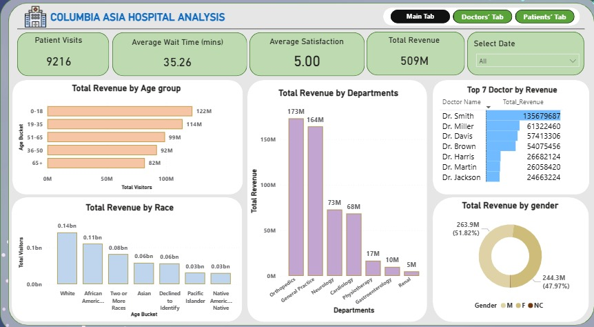
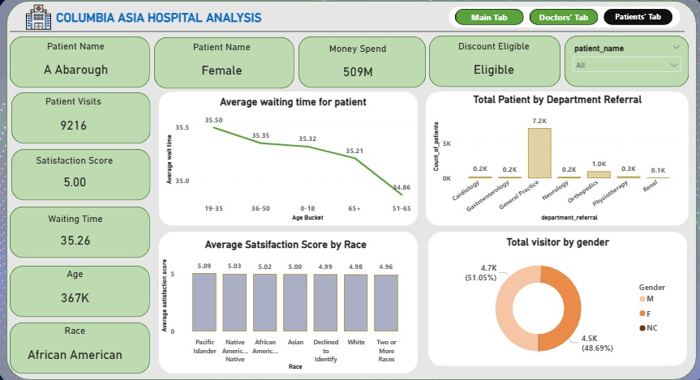
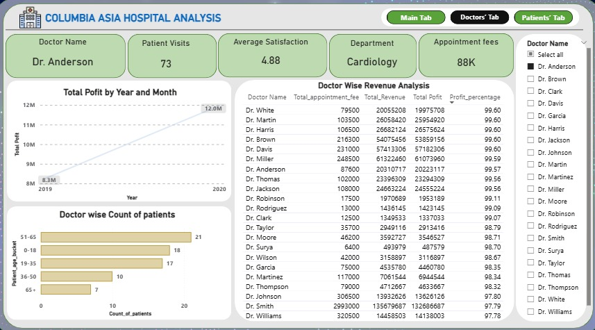

# 🏥 Columbia Asia Hospital Analysis (Power BI)

## 📸 Dashboard Preview

## 📊 Overview
This project analyzes hospital operational data to uncover key insights related to patient visits, revenue, and performance across departments.

## 🎯 Business Problem
Hospitals struggle to track:
- Patient flow
- Department performance
- Revenue distribution
- Waiting times

This dashboard solves these using interactive visual analytics.

## 🛠 Tools Used
- Power BI
- Excel
- SQL

## 📈 Key Insights
- General Practice generates the highest revenue
- Age group 19–35 dominates hospital visits
- Average waiting time is ~35 minutes
- High satisfaction score indicates strong service quality

## 📂 Project Structure
- dashboard/ → Power BI file (.pbix)
- presentation/ → PPT
- docs/ → Documentation
- sql/ → SQL queries

## 🚀 How to Use
1. Download `.pbix`
2. Open in Power BI Desktop
3. Explore dashboard

## 👤 Author
Rajesh MM
